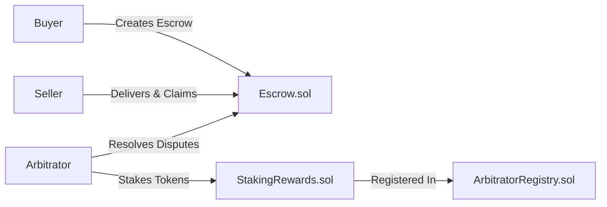

# Project 1: DeFi Escrow Platform

A learning-focused build of a production-quality escrow system.

---

## What You'll Learn

| Component | Skills Gained |
|-----------|--------------|
| Escrow.sol | State machines, reentrancy protection, ERC-20 handling |
| StakingRewards.sol | Time-based rewards, stake/unstake patterns |
| ArbitratorRegistry.sol | Access control, registry patterns |
| Frontend | Web3 integration, wallet connection, contract interactions |

---

## Architecture Overview



---

## Proposed Files

### Smart Contracts

#### [NEW] [Escrow.sol](file:///g:/hakirat_cohort/portfolio_project/portfolio-projects/01-defi-escrow/contracts/src/Escrow.sol)
Core escrow logic with states: Created → Funded → Delivered → Completed/Disputed

#### [NEW] [StakingRewards.sol](file:///g:/hakirat_cohort/portfolio_project/portfolio-projects/01-defi-escrow/contracts/src/StakingRewards.sol)
Arbitrators stake tokens to earn rewards and participate in disputes

#### [NEW] [ArbitratorRegistry.sol](file:///g:/hakirat_cohort/portfolio_project/portfolio-projects/01-defi-escrow/contracts/src/ArbitratorRegistry.sol)
Registry of approved arbitrators with minimum stake requirements

### Tests

#### [NEW] [Escrow.t.sol](file:///g:/hakirat_cohort/portfolio_project/portfolio-projects/01-defi-escrow/contracts/test/Escrow.t.sol)
Full test coverage for escrow flows

### Frontend (After Contracts)
- React + Vite app with wallet connection
- Create, fund, and manage escrows

---

## Build Order (Step by Step)

### Step 1: Initialize Foundry Project
```bash
cd portfolio-projects/01-defi-escrow
forge init contracts
```

### Step 2: Build Escrow.sol
- State enum (Created, Funded, Delivered, Completed, Disputed, Refunded)
- Create, fund, deliver, complete, dispute, resolve functions
- Events for all state changes

### Step 3: Build Staking & Registry
- Stake/unstake mechanics
- Minimum stake requirements
- Reward distribution

### Step 4: Write Tests
- Happy path tests
- Edge cases
- Dispute resolution tests

### Step 5: Frontend
- Wallet connection
- Contract interactions
- State display

---

## Verification Plan

### Automated Tests
```bash
forge test -vvv
forge coverage
```

### Manual Verification
- Deploy to Sepolia testnet
- Test full escrow flow with MetaMask
- Verify on Etherscan

---

> [!IMPORTANT]
> Ready to start? I'll begin with Step 1 (Foundry init) and Step 2 (Escrow.sol).
